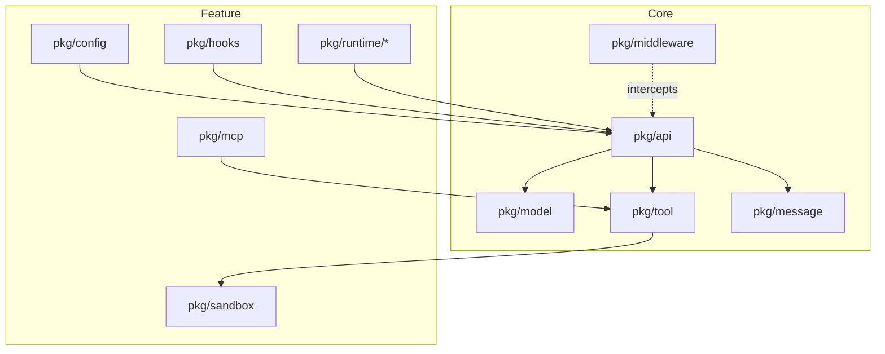

[中文](README_zh.md) | English

# agentsdk-go

An Agent SDK implemented in Go that implements core Claude Code-style runtime capabilities, plus an optional middleware interception layer.

## Overview

agentsdk-go is a modular agent development framework that implements core Claude Code-style runtime capabilities (Hooks, MCP, Sandbox, Skills, Subagents) and optionally exposes a four-point middleware interception mechanism. The SDK supports deployment scenarios across CLI, CI/CD, and enterprise platforms.

## Upgrading

Breaking changes for the v2 refactor are tracked in `docs/refactor/UPGRADING-v2.md`.

### Dependencies

- External dependencies: anthropic-sdk-go, fsnotify, gopkg.in/yaml.v3, google/uuid, golang.org/x/mod, golang.org/x/net

## Features

### Core Capabilities
- **Multi-model Support**: Subagent-level model binding via `ModelFactory` interface
- **Auto Compact**: Automatic context compression when token threshold reached
- **Rules Configuration**: `.agents/rules/` directory support with hot-reload
- **Safety Hook**: Go-native `PreToolUse` safety check for catastrophic bash commands (YOLO default)
- **OpenTelemetry**: Distributed tracing with span propagation
- **UUID Tracking**: Request-level UUID for observability

### Concurrency Model
- **Thread-Safe Runtime**: Runtime guards mutable state with internal locks.
- **Per-Session Mutual Exclusion**: Concurrent `Run`/`RunStream` calls on the same `SessionID` return `ErrConcurrentExecution` (callers can queue/retry if they want serialization).
- **Shutdown**: `Runtime.Close()` waits for in-flight requests to complete.
- **Validation**: run `go test -race ./...` after changes.

### Examples
- `examples/01-basic` - Minimal request/response
- `examples/02-cli` - Interactive REPL with session history
- `examples/03-http` - REST + SSE server on :8080
- `examples/04-advanced` - Full pipeline with middleware, hooks, MCP, sandbox, skills, subagents
- `examples/05-custom-tools` - Selective built-in tools and custom tool registration
- `examples/07-multimodel` - Multi-model configuration demo
- `examples/06-embed` - Embedded filesystem demo
- `examples/08-safety-hook` - Built-in safety hook and DisableSafetyHook demo
- `examples/09-compaction` - Prompt-compression compaction demo
- `examples/10-hooks` - Hooks lifecycle events
- `examples/11-reasoning` - Reasoning/thinking model support
- `examples/12-multimodal` - Image and document input

## System Architecture

### Core Layer

- `pkg/middleware` - Four interception points for extending the request/response lifecycle
- `pkg/model` - Model adapters (Anthropic Claude, OpenAI-compatible)
- `pkg/tool` - Tool registration and execution, including built-in tools and MCP tool support
- `pkg/message` - In-memory message history primitives
- `pkg/api` - Unified API surface exposing SDK features (includes the agent loop)

### Feature Layer

- `pkg/hooks` - Hooks executor + event bus (merged from `pkg/core/events` + `pkg/core/hooks`)
- `pkg/mcp` - MCP (Model Context Protocol) client bridging external tools (stdio/SSE) with automatic registration
- `pkg/sandbox` - Sandbox isolation layer controlling filesystem and network access policies
- `pkg/runtime/skills` - Skills management supporting scriptable loading and hot reload
- `pkg/runtime/subagents` - Subagent management for multi-agent orchestration and scheduling

In addition, the feature layer includes supporting packages such as `pkg/config` (configuration loading/hot reload) and `pkg/hooks` (event bus + hooks).

### Architecture Diagram



### Middleware Interception Points

The SDK exposes interception at critical stages of request handling:

```
User request
  ↓
before_agent  ← Request validation, audit logging
  ↓
Agent loop
  ↓
before_tool   ← Tool parameter validation
  ↓
Tool execution
  ↓
after_tool    ← Result post-processing
  ↓
after_agent   ← Response formatting, metrics collection
  ↓
User response
```

## Installation

### Requirements

- Go 1.24.0 or later
- Anthropic API Key (required to run examples)

### Get the SDK

```bash
go get github.com/stellarlinkco/agentsdk-go
```

## Quick Start

### Basic Example (examples/01-basic)

Run the minimal starter in `examples/01-basic`:

```bash
# 1. Set up environment
cp .env.example .env
# Edit .env: ANTHROPIC_API_KEY=sk-ant-your-key-here
source .env

# 2. Run the example
go run ./examples/01-basic
```

```go
package main

import (
    "context"
    "fmt"
    "log"

    "github.com/stellarlinkco/agentsdk-go/pkg/api"
    "github.com/stellarlinkco/agentsdk-go/pkg/model"
)

func main() {
    ctx := context.Background()

    // Create the model provider (reads ANTHROPIC_API_KEY from env automatically)
    provider := &model.AnthropicProvider{ModelName: "claude-sonnet-4-5-20250929"}

    // Initialize the runtime
    rt, err := api.New(ctx, api.Options{
        ModelFactory: provider,
    })
    if err != nil {
        log.Fatal(err)
    }
    defer rt.Close()

    // Execute a task
    resp, err := rt.Run(ctx, api.Request{
        Prompt:    "List files in the current directory",
        SessionID: "demo",
    })
    if err != nil {
        log.Fatal(err)
    }
    if resp.Result != nil {
        fmt.Println(resp.Result.Output)
    }
}
```

### Using Middleware

```go
import (
    "context"
    "log"
    "time"

    "github.com/stellarlinkco/agentsdk-go/pkg/api"
    "github.com/stellarlinkco/agentsdk-go/pkg/middleware"
)

// Logging middleware using the Funcs helper
loggingMiddleware := middleware.Funcs{
    Identifier: "logging",
    OnBeforeAgent: func(ctx context.Context, st *middleware.State) error {
        st.Values["start_time"] = time.Now()
        log.Println("[REQUEST] agent starting")
        return nil
    },
    OnAfterAgent: func(ctx context.Context, st *middleware.State) error {
        if start, ok := st.Values["start_time"].(time.Time); ok {
            log.Printf("[RESPONSE] elapsed: %v", time.Since(start))
        }
        return nil
    },
}

// Inject middleware
rt, err := api.New(ctx, api.Options{
    ModelFactory: provider,
    Middleware:   []middleware.Middleware{loggingMiddleware},
})
if err != nil {
    log.Fatal(err)
}
defer rt.Close()
```

### Streaming Output

```go
// Use the streaming API to get real-time progress
events, err := rt.RunStream(ctx, api.Request{
    Prompt:    "Analyze the repository structure",
    SessionID: "analysis",
})
if err != nil {
    log.Fatal(err)
}

for event := range events {
    switch event.Type {
    case api.EventContentBlockDelta:
        if event.Delta != nil {
            fmt.Print(event.Delta.Text)
        }
    case api.EventToolExecutionStart:
        fmt.Printf("\n[Tool] %s\n", event.Name)
    case api.EventToolExecutionResult:
        fmt.Printf("[Result] %v\n", event.Output)
    }
}
```

### Concurrent Usage

Runtime supports concurrent calls across different `SessionID`s. Calls sharing the same `SessionID` are mutually exclusive.

```go
// Same runtime can be safely used from multiple goroutines
rt, _ := api.New(ctx, api.Options{
    ModelFactory: provider,
})
defer rt.Close()

// Concurrent requests with different sessions execute in parallel
var wg sync.WaitGroup
for i := 0; i < 10; i++ {
    wg.Add(1)
    go func(id int) {
        defer wg.Done()
        resp, err := rt.Run(ctx, api.Request{
            Prompt:    fmt.Sprintf("Task %d", id),
            SessionID: fmt.Sprintf("session-%d", id), // Different sessions run concurrently
        })
        if err != nil {
            log.Printf("Task %d failed: %v", id, err)
            return
        }
        if resp.Result != nil {
            log.Printf("Task %d completed: %s", id, resp.Result.Output)
        }
    }(i)
}
wg.Wait()

// Requests with the same session ID must be serialized by the caller
_, _ = rt.Run(ctx, api.Request{Prompt: "First", SessionID: "same"})
_, _ = rt.Run(ctx, api.Request{Prompt: "Second", SessionID: "same"})
```

**Concurrency Guarantees:**
- All `Runtime` methods are safe for concurrent use across sessions
- Same-session concurrent requests return `ErrConcurrentExecution`
- Different-session requests execute in parallel
- `Runtime.Close()` gracefully waits for all in-flight requests
- No manual locking required for different sessions; serialize/queue same-session calls in the caller

### Customize Tool Registration

Choose which built-ins to load and append your own tools:

```go
rt, err := api.New(ctx, api.Options{
    ModelFactory:        provider,
    EnabledBuiltinTools: []string{"bash", "read"}, // nil = all, empty = none
    CustomTools:         []tool.Tool{&EchoTool{}},      // appended when Tools is empty
})
if err != nil {
    log.Fatal(err)
}
defer rt.Close()
```

- `EnabledBuiltinTools`: nil → all built-ins; empty slice → none; non-empty → only the listed names (case-insensitive, underscore naming).
- `CustomTools`: appended after built-ins; ignored when `Tools` is non-empty.
- `Tools`: legacy field — when non-empty it takes over the entire tool set (kept for backward compatibility).

See a runnable demo in `examples/05-custom-tools`.

## Examples

The repository includes progressive examples:
- `01-basic` – minimal single request/response.
- `02-cli` – interactive REPL with session history and optional config load.
- `03-http` – REST + SSE server on `:8080`.
- `04-advanced` – full pipeline exercising middleware, hooks, MCP, sandbox, skills, and subagents.
- `05-custom-tools` – selective built-ins plus custom tool registration.
- `07-multimodel` – multi-model tier configuration.
- `06-embed` – embedded filesystem for bundled `.agents/` configs.
- `08-safety-hook` – built-in PreToolUse safety hook and DisableSafetyHook demo.
- `09-compaction` – prompt-compression compaction.
- `10-hooks` – hooks lifecycle events.
- `11-reasoning` – reasoning/thinking model support.
- `12-multimodal` – image and document input.

## Project Structure

```
agentsdk-go/
├── pkg/                        # Core packages
│   ├── api/                    # Unified SDK interface (includes agent loop)
│   ├── config/                 # Configuration loading & validation
│   ├── gitignore/              # .gitignore matcher (glob/grep)
│   ├── hooks/                  # Hook executor + 7 events
│   ├── mcp/                    # MCP client
│   ├── message/                # Message history management
│   ├── middleware/             # Middleware chain (4 stages)
│   ├── model/                  # Model adapters (Anthropic/OpenAI)
│   ├── runtime/
│   │   ├── skills/             # Skills management
│   │   └── subagents/          # Subagents management
│   ├── sandbox/                # Filesystem/network/resource isolation
│   └── tool/
│       └── builtin/            # Built-in tools (bash/read/write/edit/glob/grep/skill)
├── cmd/cli/                    # CLI entrypoint
├── examples/                   # Example code
│   ├── 01-basic/               # Minimal single request/response
│   ├── 02-cli/                 # CLI REPL with session history
│   ├── 03-http/                # HTTP server (REST + SSE)
│   ├── 04-advanced/            # Full pipeline (middleware, hooks, MCP, sandbox, skills, subagents)
│   └── 05-custom-tools/        # Custom tool registration and selective built-in tools
├── test/integration/           # Integration tests
└── docs/                       # Documentation
```

## Configuration

The SDK uses the `.agents/` directory for configuration:

```
.agents/
├── settings.json        # Project configuration
├── settings.local.json  # Local overrides (gitignored)
├── rules/               # Rules definitions (markdown)
├── skills/              # Skills definitions
└── agents/              # Subagents definitions
```

Configuration precedence (high → low):
- Runtime overrides (CLI/API-provided)
- `.agents/settings.local.json`
- `.agents/settings.json`
- `~/.agents/settings.json` (global home directory config)
- Built-in defaults (shipped with the SDK)

### Configuration Example

```json
{
  "permissions": {
    "additionalDirectories": []
  },
  "disallowedTools": ["bash"],
  "env": {
    "MY_VAR": "value"
  },
  "sandbox": {
    "enabled": false
  }
}
```

### Token Statistics & Auto Compact

```go
rt, err := api.New(ctx, api.Options{
    ModelFactory: provider,
    // Auto compact settings
    AutoCompact: api.CompactConfig{
        Enabled:       true,
        Threshold:     0.8,   // Trigger compact at 80% of token limit
        PreserveCount: 5,     // Keep last 5 messages intact
    },
    TokenLimit: 200000, // Model context window size hint (used for compaction decisions)
})

resp, _ := rt.Run(ctx, api.Request{Prompt: "hello"})
log.Printf("Tokens: input=%d output=%d total=%d", resp.Result.Usage.InputTokens, resp.Result.Usage.OutputTokens, resp.Result.Usage.TotalTokens)
```

## HTTP API

The SDK provides an HTTP server implementation with SSE streaming.

### Start the Server

```bash
export ANTHROPIC_API_KEY=sk-ant-...
cd examples/03-http
go run .
```

The server listens on `:8080` by default and exposes these endpoints:

- `GET /health` - Liveness probe
- `POST /v1/run` - Synchronous execution returning the full result
- `POST /v1/run/stream` - SSE streaming with real-time progress

### Streaming API Example

```bash
curl -N -X POST http://localhost:8080/v1/run/stream \
  -H 'Content-Type: application/json' \
  -d '{
    "prompt": "List the current directory",
    "session_id": "demo"
  }'
```

The response format follows the Anthropic Messages API and includes these event types:

- `message_start` / `message_stop` - Message boundaries
- `content_block_start` / `content_block_stop` - Content block boundaries
- `content_block_delta` - Incremental text output
- `message_delta` - Message-level deltas (usage, stop reason)
- `agent_start` / `agent_stop` - Agent execution boundaries
- `iteration_start` / `iteration_stop` - Iteration boundaries
- `tool_execution_start` / `tool_execution_result` - Tool execution progress
- `tool_execution_output` - Streaming tool output (stdout/stderr)

## Testing

### Run Tests

```bash
# All tests
go test ./...

# Core module tests
go test ./pkg/api/... ./pkg/middleware/... ./pkg/model/...

# Integration tests
go test ./test/integration/...

# Generate coverage report
go test -coverprofile=coverage.out ./...
go tool cover -html=coverage.out
```

### Coverage

Coverage numbers change over time; generate a report with `go test -coverprofile=coverage.out ./...`.

## Build

### Makefile Commands

```bash
# Run tests
make test

# Generate coverage report
make coverage

# Lint code
make lint

# Build CLI tool
make agentctl

# Install into GOPATH
make install

# Clean build artifacts
make clean
```

## Built-in Tools

The SDK ships with the following built-in tools:

### Core Tools (under `pkg/tool/builtin/`)
- `bash` - Execute commands via bash with a timeout and sandboxed working directory
- `read` - Read file contents
- `write` - Write file contents (create/overwrite)
- `edit` - Edit files with string replacement
- `glob` - File pattern matching
- `grep` - Regex search
- `skill` - Execute skills from `.agents/skills/`

All built-in tools obey sandbox policies. Bash execution is additionally guarded by the built-in safety hook (can be disabled via `DisableSafetyHook=true`).

## Security Mechanisms

### Sandbox + Safety Hook

1. **Sandbox** (`pkg/sandbox`): filesystem / network / resource isolation (opt-in via settings/options)
2. **Safety hook** (`pkg/hooks/safety.go`): Go-native `PreToolUse` check that blocks catastrophic bash commands in YOLO-default mode; disable via `DisableSafetyHook=true`

## Development Guide

### Add a Custom Tool

Implement the `tool.Tool` interface:

```go
type CustomTool struct{}

func (t *CustomTool) Name() string {
    return "custom_tool"
}

func (t *CustomTool) Description() string {
    return "Tool description"
}

func (t *CustomTool) Schema() *tool.JSONSchema {
    return &tool.JSONSchema{
        Type: "object",
        Properties: map[string]interface{}{
            "param": map[string]interface{}{
                "type": "string",
                "description": "Parameter description",
            },
        },
        Required: []string{"param"},
    }
}

func (t *CustomTool) Execute(ctx context.Context, params map[string]any) (*tool.ToolResult, error) {
    // Tool implementation
    return &tool.ToolResult{
        Success: true,
        Output:  "Execution result",
    }, nil
}
```

### Add Middleware

```go
customMiddleware := middleware.Funcs{
    Identifier: "custom",
    OnBeforeAgent: func(ctx context.Context, st *middleware.State) error {
        // Pre-request handling
        return nil
    },
    OnAfterAgent: func(ctx context.Context, st *middleware.State) error {
        // Post-response handling
        return nil
    },
    OnBeforeTool: func(ctx context.Context, st *middleware.State) error {
        // Before tool execution; st.ToolCall holds the agent.ToolCall
        return nil
    },
    OnAfterTool: func(ctx context.Context, st *middleware.State) error {
        // After tool execution; st.ToolResult holds the agent.ToolResult
        return nil
    },
}
```

## Design Principles

### KISS (Keep It Simple, Stupid)

- Single responsibility; each module has a clear role
- Avoid overdesign and unnecessary abstractions

### Configuration-Driven

- Manage all configuration under `.agents/`
- Supports hot reload without restarting the service
- Declarative configuration preferred over imperative code

### Modularity

- Independent packages with loose coupling
- Clear interface boundaries
- Easy to test and maintain

### Extensibility

- Middleware mechanism for flexible extensions
- Tool system supports custom tool registration
- MCP protocol integrates external tools

## Documentation

- [PRD (v2 refactor)](docs/refactor/PRD.md) - Stories/FR/Acceptance Matrix (ground truth)
- [Architecture (v2 refactor)](docs/refactor/ARCHITECTURE-v2.md) - Ground-truth v2 architecture
- [Getting Started](docs/getting-started.md) - Step-by-step tutorial
- [Security](docs/security.md) - Security configuration guide
- [Custom Tools Guide](docs/custom-tools-guide.md) - Custom tool registration and usage
- [Trace System](docs/trace-system.md) - OpenTelemetry and HTTP trace setup
- [Smart Defaults](docs/smart-defaults.md) - Auto-configuration by EntryPoint
- [HTTP API Guide](examples/03-http/README.md) - HTTP server instructions
- Legacy docs (v1, kept for historical reference only): `docs/architecture.md`, `docs/api-reference.md`

## Tech Stack

- Go 1.24.0+
- [anthropic-sdk-go](https://github.com/anthropics/anthropic-sdk-go) - Anthropic official SDK
- [modelcontextprotocol/go-sdk](https://github.com/modelcontextprotocol/go-sdk) - Official MCP SDK
- [fsnotify](https://github.com/fsnotify/fsnotify) - Filesystem watchers
- [yaml.v3](https://gopkg.in/yaml.v3) - YAML parser
- [google/uuid](https://github.com/google/uuid) - UUID utilities
- [golang.org/x/mod](https://pkg.go.dev/golang.org/x/mod) - Module utilities
- [golang.org/x/net](https://pkg.go.dev/golang.org/x/net) - Extended net packages

## License

See [LICENSE](LICENSE).
