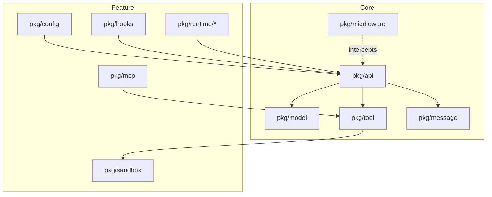

中文 | [English](README.md)

# agentsdk-go

基于 Go 语言实现的 Agent SDK，实现 Claude Code 风格的核心运行时能力，并提供可选的 Middleware 拦截机制。

## 概述

agentsdk-go 是一个模块化的 Agent 开发框架，实现 Claude Code 风格的核心运行时能力（Hooks、MCP、Sandbox、Skills、Subagents），并在此基础上提供可选的 4 点 Middleware 拦截机制。该 SDK 支持 CLI、CI/CD 和企业平台等多种部署场景。

## 升级说明

v2 重构相关的不兼容变更与迁移清单见 `docs/refactor/UPGRADING-v2.md`。

### 依赖

- 外部依赖：anthropic-sdk-go、fsnotify、gopkg.in/yaml.v3、google/uuid、golang.org/x/mod、golang.org/x/net

## 特性

### 核心能力

- **多模型支持**：通过 `ModelFactory` 接口实现 Subagent 级别的模型绑定
- **自动 Compact**：当 Token 达到阈值时自动压缩上下文
- **Rules 配置**：支持 `.agents/rules/` 目录并支持热重载
- **Safety Hook**：Go-native `PreToolUse` safety check，默认阻止灾难性 bash 命令（YOLO）
- **OpenTelemetry**：分布式追踪与 span 传播
- **UUID 追踪**：请求级别的 UUID 用于可观测性

### 示例
- `examples/01-basic` - 最小化请求/响应
- `examples/02-cli` - 交互式 REPL 带会话历史
- `examples/03-http` - REST + SSE 服务器（:8080）
- `examples/04-advanced` - 完整流程（middleware、hooks、MCP、sandbox、skills、subagents）
- `examples/05-custom-tools` - 选择性内置工具 + 自定义工具注册
- `examples/07-multimodel` - 多模型配置演示
- `examples/06-embed` - 内嵌文件系统演示
- `examples/08-safety-hook` - 内置 Safety Hook 与 DisableSafetyHook 演示
- `examples/09-compaction` - Prompt-compression compaction 演示
- `examples/10-hooks` - Hooks 生命周期事件
- `examples/11-reasoning` - 推理/思考模型支持
- `examples/12-multimodal` - 图片与文档输入

### 并发模型
- **线程安全 Runtime**：内部对可变状态加锁。
- **会话互斥**：相同 `SessionID` 的并发 `Run`/`RunStream` 会返回 `ErrConcurrentExecution`（需要串行化时由调用方自行排队/重试）。
- **关闭**：`Runtime.Close()` 等待所有进行中的请求完成。
- **验证**：修改后运行 `go test -race ./...`。

## 系统架构

### 核心层

- `pkg/middleware` - 4 点拦截机制，支持请求/响应生命周期的扩展
- `pkg/model` - 模型适配器（Anthropic Claude、OpenAI 兼容）
- `pkg/tool` - 工具注册与执行，包含内置工具和 MCP 工具支持
- `pkg/message` - 内存中的消息历史基础类型
- `pkg/api` - 统一 API 接口，对外暴露 SDK 功能（包含 agent loop）

### 功能层

- `pkg/hooks` - Hooks 执行器 + 事件总线（由 `pkg/core/events` + `pkg/core/hooks` 合并）
- `pkg/mcp` - MCP（Model Context Protocol）客户端，桥接外部工具（stdio/SSE）并自动注册
- `pkg/sandbox` - 沙箱隔离层，控制文件系统与网络访问策略
- `pkg/runtime/skills` - Skills 管理，支持脚本化技能装载与热更新
- `pkg/runtime/subagents` - Subagents 管理，负责多智能体的编排与调度

此外，功能层还包含 `pkg/config`（配置加载/热更新）与 `pkg/hooks`（事件总线 + hooks）等支撑包。

### 架构图



### Middleware 拦截点

SDK 在请求处理的关键节点提供拦截能力：

```
用户请求
  ↓
before_agent  ← 请求验证、审计日志
  ↓
Agent 循环
  ↓
before_tool   ← 工具参数验证
  ↓
工具执行
  ↓
after_tool    ← 结果后处理
  ↓
after_agent   ← 响应格式化、指标采集
  ↓
用户响应
```

## 安装

### 环境要求

- Go 1.24.0 或更高版本
- Anthropic API Key（运行示例需要）

### 获取 SDK

```bash
go get github.com/stellarlinkco/agentsdk-go
```

## 快速开始

### 基础示例（examples/01-basic）

在 `examples/01-basic` 中运行最小化示例：

```bash
# 1. 配置环境
cp .env.example .env
# 编辑 .env：ANTHROPIC_API_KEY=sk-ant-your-key-here
source .env

# 2. 运行示例
go run ./examples/01-basic
```

```go
package main

import (
    "context"
    "fmt"
    "log"

    "github.com/stellarlinkco/agentsdk-go/pkg/api"
    "github.com/stellarlinkco/agentsdk-go/pkg/model"
)

func main() {
    ctx := context.Background()

    // 创建模型提供者（自动从环境变量读取 ANTHROPIC_API_KEY）
    provider := &model.AnthropicProvider{ModelName: "claude-sonnet-4-5-20250929"}

    // 初始化运行时
    rt, err := api.New(ctx, api.Options{
        ModelFactory: provider,
    })
    if err != nil {
        log.Fatal(err)
    }
    defer rt.Close()

    // 执行任务
    resp, err := rt.Run(ctx, api.Request{
        Prompt:    "列出当前目录下的文件",
        SessionID: "demo",
    })
    if err != nil {
        log.Fatal(err)
    }
    if resp.Result != nil {
        fmt.Println(resp.Result.Output)
    }
}
```

### 使用 Middleware

```go
import (
    "context"
    "log"
    "time"

    "github.com/stellarlinkco/agentsdk-go/pkg/api"
    "github.com/stellarlinkco/agentsdk-go/pkg/middleware"
)

// 使用 Funcs 辅助构造日志中间件
loggingMiddleware := middleware.Funcs{
    Identifier: "logging",
    OnBeforeAgent: func(ctx context.Context, st *middleware.State) error {
        st.Values["start_time"] = time.Now()
        log.Println("[REQUEST] agent starting")
        return nil
    },
    OnAfterAgent: func(ctx context.Context, st *middleware.State) error {
        if start, ok := st.Values["start_time"].(time.Time); ok {
            log.Printf("[RESPONSE] 耗时: %v", time.Since(start))
        }
        return nil
    },
}

// 注入 Middleware
rt, err := api.New(ctx, api.Options{
    ModelFactory: provider,
    Middleware:   []middleware.Middleware{loggingMiddleware},
})
if err != nil {
    log.Fatal(err)
}
defer rt.Close()
```

### 流式输出

```go
// 使用流式 API 获取实时进度
events, err := rt.RunStream(ctx, api.Request{
    Prompt:    "分析代码库结构",
    SessionID: "analysis",
})
if err != nil {
    log.Fatal(err)
}

for event := range events {
    switch event.Type {
    case api.EventContentBlockDelta:
        if event.Delta != nil {
            fmt.Print(event.Delta.Text)
        }
    case api.EventToolExecutionStart:
        fmt.Printf("\n[工具执行] %s\n", event.Name)
    case api.EventToolExecutionResult:
        fmt.Printf("[工具结果] %v\n", event.Output)
    }
}
```

### 并发使用

Runtime 支持不同 `SessionID` 的并发调用；相同 `SessionID` 互斥执行。

```go
// 同一个 runtime 可以安全地从多个 goroutine 使用
rt, _ := api.New(ctx, api.Options{
    ModelFactory: provider,
})
defer rt.Close()

// 不同会话的并发请求会并行执行
var wg sync.WaitGroup
for i := 0; i < 10; i++ {
    wg.Add(1)
    go func(id int) {
        defer wg.Done()
        resp, err := rt.Run(ctx, api.Request{
            Prompt:    fmt.Sprintf("任务 %d", id),
            SessionID: fmt.Sprintf("session-%d", id), // 不同会话并发执行
        })
        if err != nil {
            log.Printf("任务 %d 失败: %v", id, err)
            return
        }
        if resp.Result != nil {
            log.Printf("任务 %d 完成: %s", id, resp.Result.Output)
        }
    }(i)
}
wg.Wait()

// 相同 session ID 的请求需要由调用方串行化
_, _ = rt.Run(ctx, api.Request{Prompt: "第一个", SessionID: "same"})
_, _ = rt.Run(ctx, api.Request{Prompt: "第二个", SessionID: "same"})
```

**并发保证：**
- `Runtime` 方法可并发使用（不同会话互不影响）
- 同会话并发请求返回 `ErrConcurrentExecution`
- 不同会话请求并行执行
- `Runtime.Close()` 优雅等待所有进行中的请求
- 不同会话无需手动加锁；同会话如需排队由调用方自行处理

### 自定义工具注册

选择要加载的内置工具并追加自定义工具：

```go
rt, err := api.New(ctx, api.Options{
    ModelFactory:        provider,
    EnabledBuiltinTools: []string{"bash", "read"}, // nil=全部，空切片=禁用全部
    CustomTools:         []tool.Tool{&EchoTool{}},      // 当 Tools 为空时追加
})
if err != nil {
    log.Fatal(err)
}
defer rt.Close()
```

- `EnabledBuiltinTools`：nil→全部内置；空切片→禁用内置；非空→只启用列出的内置（大小写不敏感，下划线命名）。
- `CustomTools`：追加自定义工具；当 `Tools` 非空时被忽略。
- `Tools`：旧字段，非空时完全接管工具集（保持向后兼容）。

完整示例见 `examples/05-custom-tools`。

## 示例

仓库包含多个渐进式示例：
- `01-basic` - 最小化单次请求/响应
- `02-cli` - 交互式 REPL（会话历史 + 可选配置加载）
- `03-http` - REST + SSE 服务器（`:8080`）
- `04-advanced` - 完整流程（middleware、hooks、MCP、sandbox、skills、subagents）
- `05-custom-tools` - 选择性内置工具 + 自定义工具注册
- `06-embed` - 内嵌文件系统演示
- `07-multimodel` - 多模型层级配置演示
- `08-safety-hook` - 内置 Safety Hook 与 DisableSafetyHook 演示
- `09-compaction` - Prompt-compression compaction 演示
- `10-hooks` - Hooks 生命周期事件
- `11-reasoning` - 推理/思考模型支持
- `12-multimodal` - 图片与文档输入

## 项目结构

```
agentsdk-go/
├── pkg/                        # 核心包
│   ├── api/                    # SDK 统一入口（包含 agent loop）
│   ├── config/                 # 配置加载与校验
│   ├── gitignore/              # .gitignore 匹配器（glob/grep）
│   ├── hooks/                  # Hooks 执行器 + 7 个事件
│   ├── mcp/                    # MCP 客户端
│   ├── message/                # 消息历史管理
│   ├── middleware/             # Middleware（4 个阶段）
│   ├── model/                  # 模型适配器（Anthropic/OpenAI）
│   ├── runtime/
│   │   ├── skills/             # Skills 管理
│   │   └── subagents/          # Subagents 管理
│   ├── sandbox/                # 文件系统/网络/资源隔离
│   └── tool/
│       └── builtin/            # 内置工具（bash/read/write/edit/glob/grep/skill）
├── cmd/cli/                    # CLI 入口
├── examples/                   # 示例代码
│   ├── 01-basic/               # 最小化单次请求/响应
│   ├── 02-cli/                 # 交互式 REPL 带会话历史
│   ├── 03-http/                # HTTP 服务器（REST + SSE）
│   ├── 04-advanced/            # 完整流程（middleware、hooks、MCP、sandbox、skills、subagents）
│   └── 05-custom-tools/        # 自定义工具注册与选择性内置工具
├── test/integration/           # 集成测试
└── docs/                       # 文档
```

## 配置

SDK 使用 `.agents/` 目录进行配置：

```
.agents/
├── settings.json        # 项目配置
├── settings.local.json  # 本地覆盖（已加入 .gitignore）
├── rules/               # Rules 定义（markdown）
├── skills/              # Skills 定义
└── agents/              # Subagents 定义
```

### 配置优先级

- 运行时覆盖（最高优先级，CLI / API 提供的配置）
- `.agents/settings.local.json`
- `.agents/settings.json`
- `~/.agents/settings.json`（全局用户配置）
- SDK 内置默认值

### 配置示例

```json
{
  "permissions": {
    "additionalDirectories": []
  },
  "disallowedTools": ["bash"],
  "env": {
    "MY_VAR": "value"
  },
  "sandbox": {
    "enabled": false
  }
}
```

### Token 统计与自动 Compact

```go
rt, err := api.New(ctx, api.Options{
    ModelFactory: provider,
    // 自动 compact 配置
    AutoCompact: api.CompactConfig{
        Enabled:       true,
        Threshold:     0.8,   // 达到 Token 上限的 80% 时触发 compact
        PreserveCount: 5,     // 保留最近 5 条消息不变
    },
    TokenLimit: 200000, // 模型上下文窗口大小提示（用于 compact 决策）
})

resp, _ := rt.Run(ctx, api.Request{Prompt: "你好"})
log.Printf("Tokens: input=%d output=%d total=%d", resp.Result.Usage.InputTokens, resp.Result.Usage.OutputTokens, resp.Result.Usage.TotalTokens)
```

## HTTP API

SDK 提供 HTTP 服务器实现，支持 SSE 流式推送。

### 启动服务器

```bash
export ANTHROPIC_API_KEY=sk-ant-...
cd examples/03-http
go run .
```

服务器默认监听 `:8080`，提供以下端点：

- `GET /health` - 健康检查
- `POST /v1/run` - 同步执行，返回完整结果
- `POST /v1/run/stream` - SSE 流式输出，实时返回进度

### 流式 API 示例

```bash
curl -N -X POST http://localhost:8080/v1/run/stream \
  -H 'Content-Type: application/json' \
  -d '{
    "prompt": "列出当前目录",
    "session_id": "demo"
  }'
```

响应格式遵循 Anthropic Messages API 规范，包含以下事件类型：

- `message_start` / `message_stop` - 消息边界
- `content_block_start` / `content_block_stop` - 内容块边界
- `content_block_delta` - 文本增量输出
- `message_delta` - 消息级增量（用量、停止原因）
- `agent_start` / `agent_stop` - Agent 执行边界
- `iteration_start` / `iteration_stop` - 迭代边界
- `tool_execution_start` / `tool_execution_result` - 工具执行进度
- `tool_execution_output` - 流式工具输出（stdout/stderr）

## 测试

### 运行测试

```bash
# 所有测试
go test ./...

# 核心模块测试
go test ./pkg/api/... ./pkg/middleware/... ./pkg/model/...

# 集成测试
go test ./test/integration/...

# 生成覆盖率报告
go test -coverprofile=coverage.out ./...
go tool cover -html=coverage.out
```

### 覆盖率

覆盖率会随代码变化；请使用 `go test -coverprofile=coverage.out ./...` 生成报告。

## 构建

### Makefile 命令

```bash
# 运行测试
make test

# 生成覆盖率报告
make coverage

# 代码检查
make lint

# 构建 CLI 工具
make agentctl

# 安装到 GOPATH
make install

# 清理构建产物
make clean
```

## 内置工具

SDK 包含以下内置工具：

### 核心工具（位于 `pkg/tool/builtin/`）
- `bash` - 通过 bash 执行命令，支持超时与沙箱工作目录
- `read` - 读取文件内容
- `write` - 写入文件内容（创建/覆盖）
- `edit` - 编辑文件（字符串替换）
- `glob` - 文件模式匹配
- `grep` - 正则搜索
- `skill` - 执行 `.agents/skills/` 中的技能

所有内置工具遵循沙箱策略；bash 额外受 safety hook 保护（可通过 `DisableSafetyHook=true` 禁用）。

## 安全机制

### Sandbox + Safety Hook

1. **Sandbox**（`pkg/sandbox`）：文件系统 / 网络 / 资源隔离（通过 settings/options 配置）
2. **Safety hook**（`pkg/hooks/safety.go`）：Go-native `PreToolUse` 检查，默认阻止灾难性 bash 命令；可通过 `DisableSafetyHook=true` 禁用

## 开发指南

### 添加自定义工具

实现 `tool.Tool` 接口：

```go
type CustomTool struct{}

func (t *CustomTool) Name() string {
    return "custom_tool"
}

func (t *CustomTool) Description() string {
    return "工具描述"
}

func (t *CustomTool) Schema() *tool.JSONSchema {
    return &tool.JSONSchema{
        Type: "object",
        Properties: map[string]interface{}{
            "param": map[string]interface{}{
                "type": "string",
                "description": "参数说明",
            },
        },
        Required: []string{"param"},
    }
}

func (t *CustomTool) Execute(ctx context.Context, params map[string]any) (*tool.ToolResult, error) {
    // 工具实现
    return &tool.ToolResult{
        Success: true,
        Output:  "执行结果",
    }, nil
}
```

### 添加 Middleware

```go
mw := middleware.Funcs{
    Identifier:   "custom",
    OnBeforeAgent: func(ctx context.Context, st *middleware.State) error { return nil },
    OnBeforeTool:  func(ctx context.Context, st *middleware.State) error { return nil },
    OnAfterTool:   func(ctx context.Context, st *middleware.State) error { return nil },
    OnAfterAgent:  func(ctx context.Context, st *middleware.State) error { return nil },
}
```

## 设计原则

### KISS（Keep It Simple, Stupid）

- 单一职责，每个模块功能明确
- 避免过度设计和不必要的抽象

### 配置驱动

- 通过 `.agents/` 目录管理所有配置
- 支持热更新，无需重启服务
- 声明式配置优于命令式代码

### 模块化

- 多个独立包，松耦合设计
- 清晰的接口边界
- 易于测试和维护

### 可扩展性

- Middleware 机制支持灵活扩展
- 工具系统支持自定义工具注册
- MCP 协议支持外部工具集成

## 文档

- [PRD（v2 重构）](docs/refactor/PRD.md) - Stories/FR/Acceptance Matrix（基准）
- [架构（v2 重构）](docs/refactor/ARCHITECTURE-v2.md) - v2 架构基准
- [入门指南](docs/getting-started.md) - 分步教程
- [安全实践](docs/security.md) - 安全配置指南
- [自定义工具指南](docs/custom-tools-guide.md) - 自定义工具注册与使用
- [Trace 系统](docs/trace-system.md) - OpenTelemetry 与 HTTP trace 配置
- [Smart Defaults](docs/smart-defaults.md) - 按 EntryPoint 自动配置
- [HTTP API 指南](examples/03-http/README.md) - HTTP 服务器使用说明
- v1 历史文档（仅供参考）：`docs/architecture.md`、`docs/api-reference.md`

## 技术栈

- Go 1.24.0+
- [anthropic-sdk-go](https://github.com/anthropics/anthropic-sdk-go) - Anthropic 官方 SDK
- [modelcontextprotocol/go-sdk](https://github.com/modelcontextprotocol/go-sdk) - 官方 MCP SDK
- [fsnotify](https://github.com/fsnotify/fsnotify) - 文件系统监控
- [yaml.v3](https://gopkg.in/yaml.v3) - YAML 解析
- [google/uuid](https://github.com/google/uuid) - UUID 工具
- [golang.org/x/mod](https://pkg.go.dev/golang.org/x/mod) - 模块工具
- [golang.org/x/net](https://pkg.go.dev/golang.org/x/net) - 扩展网络包

## 许可证

详见 [LICENSE](LICENSE) 文件。
